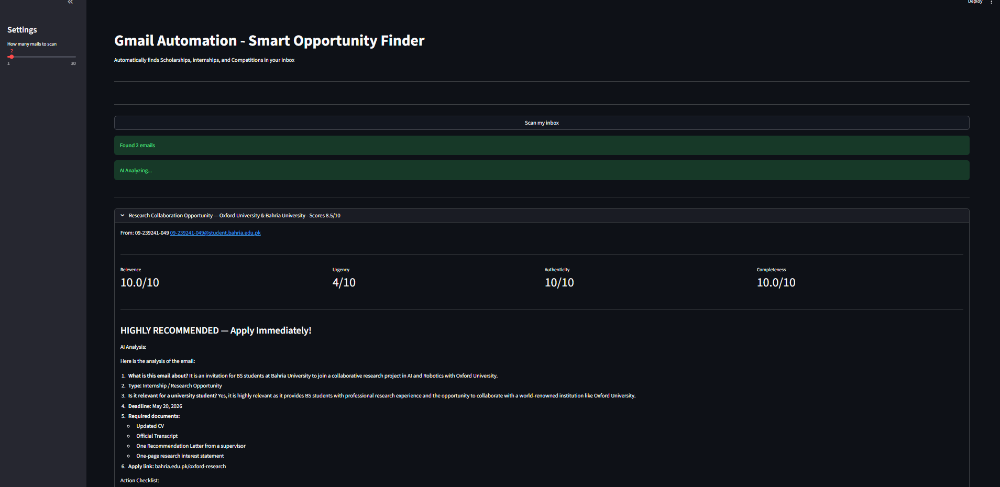

# 📧 Gmail Automation — AI-Powered Opportunity Finder

> Tired of missing scholarships, internships, and competitions buried in your inbox?  
> Gmail Automation reads, analyzes, and scores every email — so you never miss an opportunity again.

---

## 🎯 Problem Statement

University students receive dozens of emails daily. Important opportunities like scholarships, 
internships, and competitions get buried under newsletters and alerts — and are simply ignored.

**Gmail Automation solves this by:**
- Automatically scanning your inbox
- Identifying real opportunities using AI
- Scoring each email based on relevance to you
- Generating a personalized action checklist

---

## 🖥️ Demo



---

## ✨ Features

| Feature | Description |
|---|---|
| 📬 Gmail Integration | Securely connects to your Gmail inbox via Google API |
| 🤖 AI Analysis | Uses Google Gemini to summarize and classify emails |
| 📊 Smart Scoring | Custom 4-dimension scoring engine built from scratch |
| 📋 Action Checklist | Personalized step-by-step checklist for each opportunity |
| 🖥️ Interactive UI | Clean web interface built with Streamlit |

---

## 📊 Scoring Engine

Every email is scored across 4 dimensions using a custom weighted algorithm:

| Dimension | Weight | Logic |
|---|---|---|
| **Relevance** | 35% | Keyword matching against opportunity-related terms |
| **Urgency** | 25% | Deadline detection and days remaining calculation |
| **Authenticity** | 20% | Sender domain trust scoring (.edu, .gov, .org) |
| **Completeness** | 20% | Checks for deadline, link, documents, and contact info |

**Final Score Formula:**
Score = (Relevance × 0.35) + (Urgency × 0.25) + (Authenticity × 0.20) + (Completeness × 0.20)
Emails scoring **6/10 or above** receive full AI analysis and a personalized checklist.

---

## 🛠️ Tech Stack

| Layer | Technology |
|---|---|
| Language | Python 3 |
| Email Access | Gmail API (Google Cloud) |
| AI Analysis | Google Gemini 2.5 Flash |
| UI Framework | Streamlit |
| HTML Parsing | BeautifulSoup4 |

---

## 📁 Project Structure
Gmail-Automation/
│
├── app.py          → Streamlit UI — main interface
├── gmail.py        → Gmail API integration and email parsing
├── gemini.py       → Gemini AI analysis and checklist generation
├── scorer.py       → Custom scoring engine
├── main.py         → Terminal version for testing
└── README.md       → Project documentation

---

## ⚙️ Installation & Setup

### 1. Clone the repository
```bash
git clone https://github.com/yourusername/Gmail-Automation.git
cd Gmail-Automation
```

### 2. Install dependencies
```bash
pip install google-auth google-auth-oauthlib google-auth-httplib2
pip install google-api-python-client google-generativeai
pip install streamlit beautifulsoup4
```

### 3. Setup Gmail API
- Go to [Google Cloud Console](https://console.cloud.google.com)
- Create a new project and enable Gmail API
- Create OAuth 2.0 credentials
- Download and save as `credentials.json` in project folder

### 4. Setup Gemini API
- Go to [Google AI Studio](https://aistudio.google.com)
- Generate a free API key
- Add it to `gemini.py`

### 5. Run the app
```bash
streamlit run app.py
```

---

## 🔒 Security

- OAuth 2.0 used for Gmail authentication — your password is never stored
- `credentials.json` and `token.json` are excluded via `.gitignore`
- App only requests **read-only** Gmail access — cannot send or delete emails

---

## 🚀 How It Works
User clicks "Scan My Inbox"
↓
Gmail API fetches emails
↓
HTML cleaned → plain text extracted
↓
Scoring Engine scores each email (no API call)
↓
Score ≥ 6? → Gemini analyzes + generates checklist
Score < 6? → Marked as low priority, skipped
↓
Results displayed in interactive UI
---

## 👨‍💻 About The Developer

**Saim** — Robotics & Intelligent Systems Student  
Bahria University Islamabad  

Transitioning from Robotics into AI/ML Engineering with hands-on projects in:
- Computer Vision (CNN-based Hand Gesture Recognition)
- Machine Learning (Classification, Regression, Fraud Detection)
- AI-powered Applications (Gmail Automation)

[][(your-linkedin-url](https://www.linkedin.com/in/saim-ansari-990620283/)
[]([your-github-url](https://github.com/saim-ansari-tech)

---

## 📄 License

This project is open source and available under the [MIT License](LICENSE).
